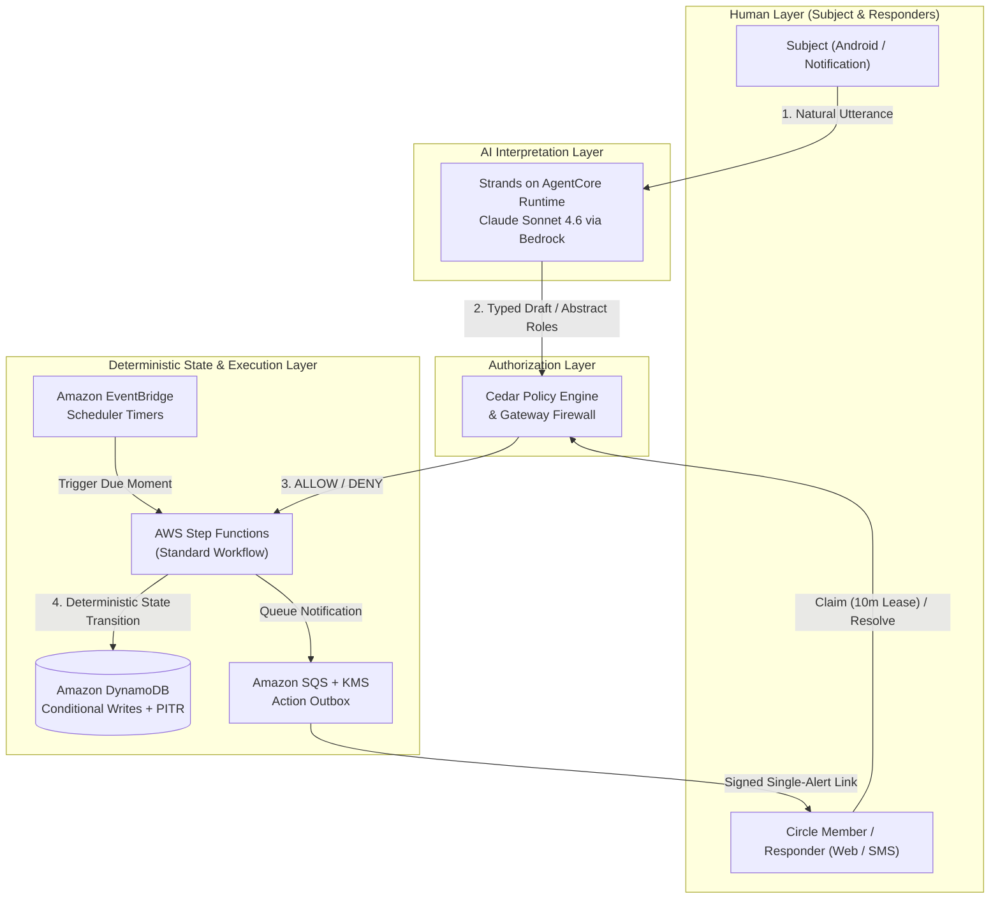
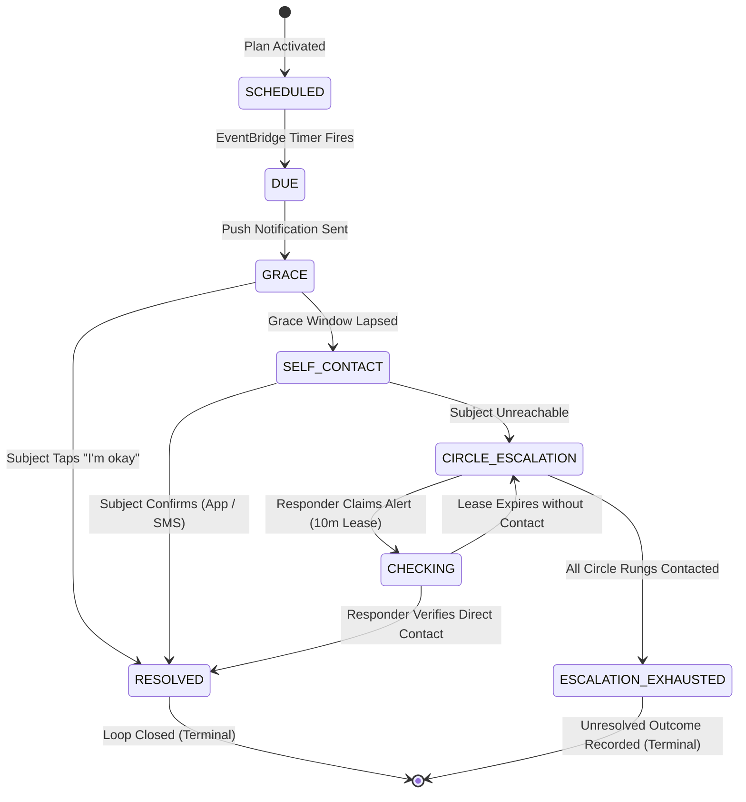

# In Case of

**Someone notices.**

In Case of is an Android-first contingency utility. Tell it what should happen. If an expected
Moment does not happen, In Case of starts with you and works through the Circle you approved until
the uncertainty is resolved.

**It monitors the plan, not the person.**

> In Case of does not decide whether someone is in danger. It notices unresolved expectations and
> works to close the loop.

---

## The idea

Millions of people spend meaningful periods alone. The usual options are **passive** — someone
remembers to call — or **surveillance**: continuous location, cameras, wearables, activity
tracking.

There is a useful layer between them. A person says what they expect to happen:

> "Check on me every night at ten."
> "I should be home before midnight."
> "I'm hiking until six."

In Case of does **nothing** while everything is normal. When an expected Moment goes unresolved, it
asks you, reminds you, contacts you, understands your answer, and — only if the uncertainty
persists — reaches the people you authorized, coordinates who is checking, and keeps going until
someone explicitly closes the loop.

A missed Moment means **unresolved**. It does not mean emergency.

---

## The engineering idea

```
AI interprets humans.
Policy authorizes actions.
Deterministic software owns safety state.
```

Language models are good at understanding what a person meant and bad at being a safety guarantee.
So the model never owns a timer, an authorization decision, a contact list, or a state transition.

Concretely:

- **The agent has no vocabulary for a phone number.** It can call
  `contact_circle_member(alert_id, member_id, channel)` — never `send_sms(number, text)`. The
  backend resolves the encrypted endpoint after checking consent, plan membership and the current
  escalation step. A fully compromised model still cannot reach an arbitrary person, because the
  words to ask for one do not exist in its tool surface.
- **Timers live in EventBridge, not on the phone.** Escalation continues if the app is killed, and
  it continues if the model is unavailable.
- **Every Alert is pinned to an immutable Plan Version.** Editing a plan mid-Alert cannot change
  what that Alert is doing.
- **Acknowledged is not resolved.** A responder tapping *I'm checking* pauses backup escalation for
  a 10-minute lease. If they vanish, the lease expires and escalation resumes.
- **Duplicate external actions are structurally impossible** — every action carries
  `alert_id + step_id + attempt_number` and dispatch is a conditional write.

---

## Built with

- **Strands Agents SDK** — the agent runtime
- **Claude Sonnet 4.6 through Amazon Bedrock** — natural-language plan compilation without a model API key
- **Amazon Bedrock AgentCore** — Strands runtime, role-only Gateway and Cedar policy enforcement
- **AWS Step Functions** — durable escalation workflows
- **EventBridge Scheduler** — safety timers that do not depend on a device
- **DynamoDB** — authoritative state
- **Amazon Cognito · SQS · KMS · Secrets Manager · CDK**
- **Android · Kotlin · Jetpack Compose**

---

## Repository layout

```
android/     Android app (Kotlin, Compose)
apps/        marketing site + responder web (no app install required)
services/    API, Strands agent, workers, callbacks (Python)
packages/    shared schemas, API contracts, golden fixtures
infra/cdk/   infrastructure as code
evals/       agent evaluation suites, including adversarial
docs/        product, architecture, domain, security and design contracts
```

## Documentation

| Document | What it governs |
|---|---|
| [`docs/CAPABILITIES.md`](docs/CAPABILITIES.md) | Evidence-backed capability, release and deployment status |
| [`docs/PRD.md`](docs/PRD.md) | Product definition, principles, scope, Definition of Done |
| [`docs/ARCHITECTURE.md`](docs/ARCHITECTURE.md) | Runtime topology, outbox, idempotency, failure behaviour |
| [`docs/ERD.md`](docs/ERD.md) | Domain model and the DynamoDB physical design |
| [`docs/PRODUCT-STATES.md`](docs/PRODUCT-STATES.md) | **Normative** Alert state machine |
| [`docs/AI-SAFETY.md`](docs/AI-SAFETY.md) | Agent boundaries, tool surface, evaluation |
| [`docs/SECURITY.md`](docs/SECURITY.md) | Threat model, responder tokens, data protection |
| [`docs/API.md`](docs/API.md) | HTTP surface |
| [`docs/DEPLOYMENT.md`](docs/DEPLOYMENT.md) | OIDC deployment and quota-blocked recovery procedure |
| [`docs/DEMO.md`](docs/DEMO.md) | Demo time compression and submission |
| [`docs/HACKATHON.md`](docs/HACKATHON.md) | Devpost submission narrative and track qualification |
| [`docs/DEMO-VIDEO-SCRIPT.md`](docs/DEMO-VIDEO-SCRIPT.md) | 4:30 video pitch storyboard and narration |
| [`docs/design/DESIGN.md`](docs/design/DESIGN.md) | Design system, palette, accessibility floor |

---

## Architecture & Security Boundary



### Escalation State Machine: *Acknowledged ≠ Resolved*



---

## Development

Requires: **uv**, **Node 22+**, **JDK 17**, **Android SDK**, and the **AWS CLI** for deploys.

```bash
uv sync && uv run pytest
```

```bash
uv run ruff check . && uv run mypy services
```

```bash
npm install && npm run build --workspaces
```

```bash
cd android && ./gradlew assembleDebug
```

Signed demo builds require protected Firebase and keystore inputs and cannot fall back to local
data. See [Android demo release](docs/ANDROID-RELEASE.md) for the reproducible build, verification
and judge-installation steps.

Copy `.env.example` to `.env` for local configuration. **Never commit `.env`** — a pre-commit hook
blocks it, along with hardcoded phone numbers and detected secrets.

---

## Status

Built for the **Agents for Humans** hackathon (2026), track: **Everyday Agents**.

This is a hackathon project. It is **not** an emergency service, and not a substitute for local
emergency services, medical care, or professional monitoring.

## Licence

[Apache-2.0](LICENSE)
