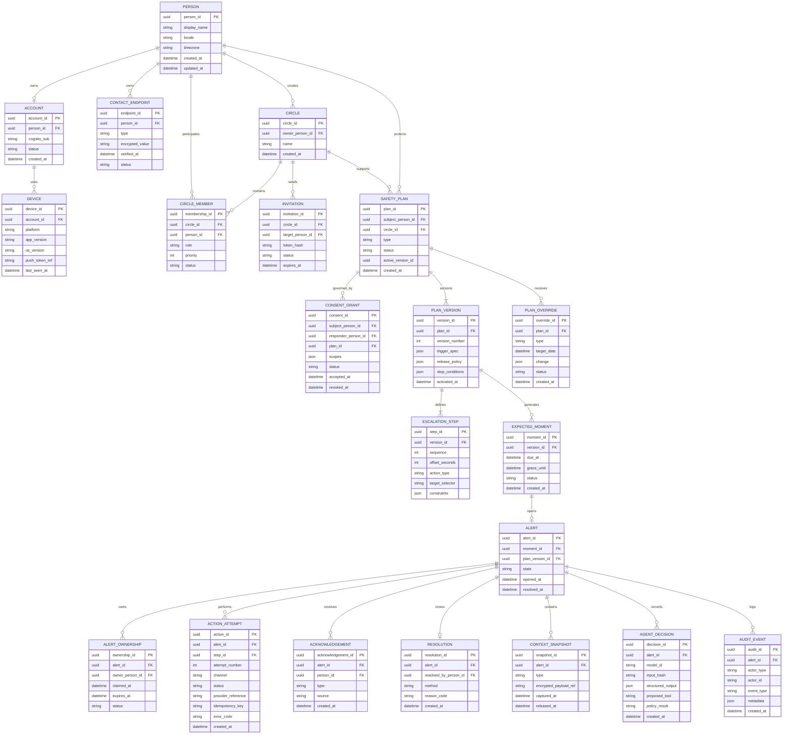

# In Case of — Domain Model

> **In Case of does not decide whether someone is in danger. It notices unresolved
> expectations and works to close the loop.**

The ERD below is the **logical** model. Section 3 defines the **physical** DynamoDB design. These
are deliberately different shapes — do not mechanically translate one into the other.

---

## 1. Entity relationship diagram



---

## 2. Design notes

**`PLAN_VERSION` is immutable once activated.** An `EXPECTED_MOMENT` references a version, not a
plan, and an `ALERT` carries `plan_version_id` for its whole life. Editing a plan creates a new
version; live Alerts keep the old one. See `docs/ARCHITECTURE.md` §4.

**`PLAN_OVERRIDE` exists so a one-day exception never mutates a recurring plan.** "Skip tomorrow"
creates an override, not a new version of the schedule.

**`ACTION_ATTEMPT.idempotency_key`** is `alert_id + step_id + attempt_number` and is uniquely
constrained. This is what makes duplicate external actions structurally impossible.

**`AGENT_DECISION` records every model proposal**, including denied ones, with `policy_result`.
This table is what the developer trace view renders and what makes §4.6 (explainability) true.

**`CONSENT_GRANT` is checked at contact time**, not only at invitation time.

---

## 3. Physical design — DynamoDB single table

Access-pattern oriented. **Do not create 18 tables.**

```
PK PERSON#<id>       SK PROFILE
PK PERSON#<id>       SK DEVICE#<id>
PK PERSON#<id>       SK ENDPOINT#<id>
PK CIRCLE#<id>       SK META
PK CIRCLE#<id>       SK MEMBER#<id>
PK PLAN#<id>         SK META
PK PLAN#<id>         SK VERSION#0004
PK PLAN#<id>         SK VERSION#0004#STEP#001
PK PLAN#<id>         SK OVERRIDE#<date>
PK MOMENT#<id>       SK META
PK ALERT#<id>        SK META
PK ALERT#<id>        SK OWNERSHIP#<timestamp>
PK ALERT#<id>        SK ACTION#<timestamp>#<id>
PK ALERT#<id>        SK DECISION#<timestamp>#<id>
PK ALERT#<id>        SK AUDIT#<timestamp>#<id>
```

Zero-padded version and step numbers (`0004`, `001`) keep lexicographic order correct.

An Alert's entire timeline — ownership, actions, agent decisions, audit — lives under one partition
key, so rendering the Incident Room and the audit trail is a single query.

### Index rule

**Create a GSI only from a demonstrated query.** Abstract future scalability is not a reason.
Every GSI added must be justified in this file with the access pattern that required it.

Current GSIs: *none yet.* Expected first: due-Moment lookup by time window, and Alerts-by-responder
for the responder web surface — both added in Phase 1/2 when the query actually exists.

### Conditional writes

- Alert creation from a Moment: conditional on no existing Alert → enforces "one Moment, one Alert."
- Action dispatch: conditional on absent idempotency key → enforces zero duplicate external actions.
- Lease claim: conditional on current owner being absent or expired → prevents two responders both
  believing they own the Alert.
